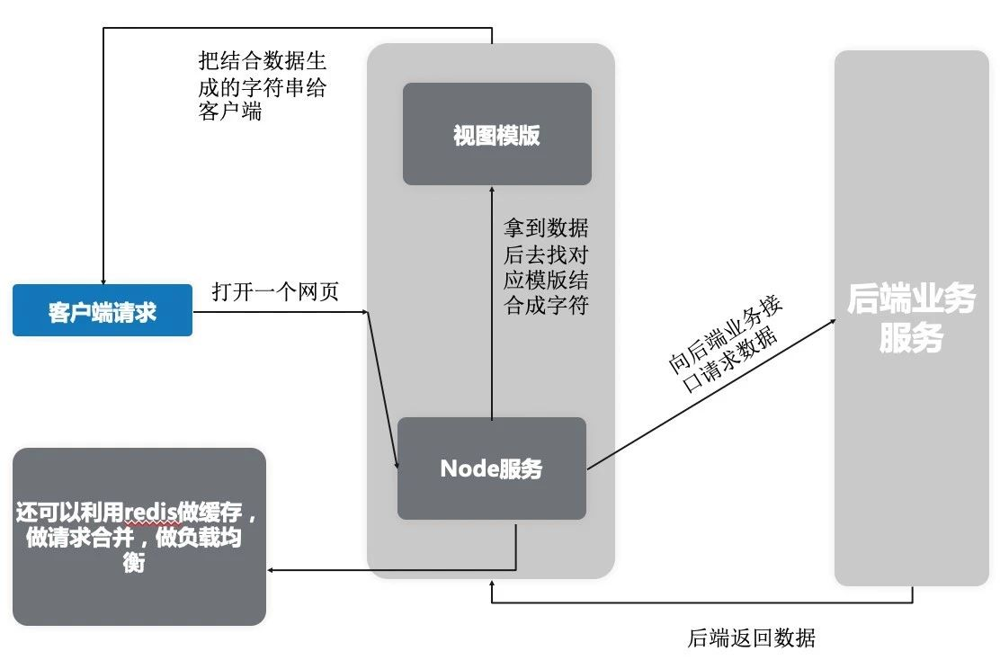

# 前言

前几天在公众号看到一篇文章，讲的是 node 能够为我们带来什么，我们学习node 究竟有什么用处，小编觉得写的非常不错，今天在这里收藏一下。

平常经常有一些伙伴 说起 学node到底有什么用，希望这篇文章对朋友们有个帮助。

## Node在一线企业中的运用

### 作为中间层

我们通常说前端和后端，前端负责用户界面，而后端负责提供数据和业务接口。现在我们在两者间加入一层，前端并不是直接去请求后端业务接口，而是请求到中间层。再由中间层去请求业务接口,看一下示意图：

整个流程可以描述为：客户端直接请求到中间层的Node服务，Node服务分析请求，看需要哪个页面，再去请求对应数据，拿到数据后和模版结合成用户看到页面，再给到客户端。

那么有的人可能会觉得，这种模式不是更麻烦了吗？其实不然，我们来看看 **中间层的优点** ：

1. 减轻客户端内存，项目用户体验好。不会像mvvm模式的项目把页面渲染和数据请求都压在客户端，而是在服务端完成。

2. SEO性好，不像mvvm模式页面由js生成，而是在服务器渲染好html 字符，有利于网页被搜索到。

3. 保持了前后端分离的优点和目的，即解放后端，后端可以继续以接口的形式写业务代码。

4. 前端可以操控的范围增多，甚至可以做服务器，数据库层面的优化，比如中间层中常常用nginx，redis来优化项目，应对高并发。

中间层模式是一种开发模式上的进步，为什么这么好的模式我从来没有听说过呢？因为这种模式成本过高，如果没有一定量级的项目没必要去采用。

### 做项目构建工具

这里说的项目构建工具，我相信大家都用过，我们的webpack，vue-cli都是输入项目构建工具。那么大家觉得这一类工具神奇好用方便的同时，有没有想过这些工具是拿什么语言写的？其实它们并不难，这些工具都是用Node来写的。

很多公司都会开发自己公司的项目构建工具，帮助公司项目做的更标准更方便，一个好的项目构建工具，会极大的加快整个公司的项目开发效率。

这一类的项目构建工具一般都要很多的文件操作，Node对于i/o流的操作，在目前的主流后端语言中数一数二。所以越来越多的公司选择用Node来做项目构建工具。

### 做一些小型网站后端

用Node做后端，可能是大多数人认为的Node作用。其实真正在企业之中，很少会让你去用Node去做后端。 所以一般来说都是做一些小型或者个人站的后端。
