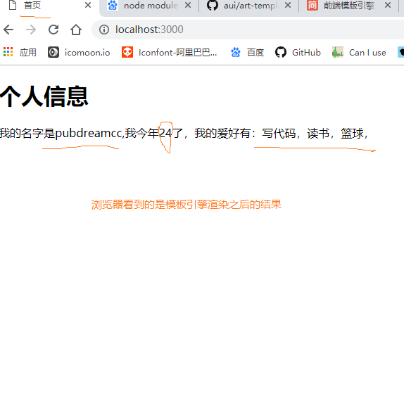

## 前言

大家之前都有使用过浏览器中js模板引擎，其实在Node.js中也可以使用模板引擎，最早使用模板引擎的概念是在服务端新起的。

## art-template

`art-template`是一款高性能的JavaScript 模板引擎，不仅可以在浏览器（前端）使用，同时也可以在Node中使用。
> GitHub地址：<a href="https://github.com/aui/art-template">art-template</a>

> 文档：<a href="https://aui.github.io/art-template/zh-cn/docs/index.html">官方中文</a> 

**本章节我们来探讨下Node中使用art-template模板引擎生成一个标准的HTML文档。**

## 主体

1. `art-template`原理就是将一个字符串数据按照模板引擎的语法替换掉其中的某些特定格式数据，然后产出我们所需的HTML文档。`art-template`支持两种语法：标准语法，原始语法，标准语法多以`{{}}`常见，原始语法多以`<% %>`常见。对于不清楚`art-template`语法的同学可以去官方文档看下，这里不做详细叙述。

2. 安装`art-template`第三方包

在项目当前目录`npm install art-template`，默认会安装在项目当前`node_modules`文件夹下。

3. 在项目中创建`template.html`文件，这里用来编写我们的模板html文档。具体代码如下：

```
<!DOCTYPE html>
<html lang="zh">
<head>
  <meta charset="UTF-8">
  <title>{{Title}}</title>  
</head>
<body>
  <h1>{{main}}</h1>
  <p>我的名字是{{name}},我今年{{age}}了，我的爱好有：{{each hobbies}}{{$value}}，{{/each}}</p>
</body>
</html>
```
**这里使用`art-template`的标准语法**，编写的时候一定按照正确的模板语法，否则会导致结果有误。

4. 项目中创建`server.js`，用来创建服务器，并且引入`art-template`包。

```
let http = require('http')
let fs = require('fs')
let template = require('art-template')

let server = http.createServer()

server.on('request', (req, res) => {
  let url = req.url
  if (url === '/') {
    // 读取template.html中的内容，并且转换成字符串格式
    fs.readFile('./template.html', (error, data) => {
      if (error) {
        return res.end('can not find template.html')
      }
      let dataStr = data.toString()
      let htmlStr = template.render(dataStr, {
        name: 'pubdreamcc',
        Title: '首页',
        main: '个人信息',
        age: 24,
        hobbies: ['写代码', '读书', '篮球']
      })  // template.render()方法编译模板文档并返回渲染结果。
      res.end(htmlStr)
    })
  } else {
    res.end('404 NOT found')
  }
})

// 绑定端口号，开启服务器
server.listen(3000, () => {
  console.log('服务器已经启动，可以访问。。。')
})

```

5. 启动服务器后，浏览器访问后，效果如下：



**到这里就已经实现了我们起初的效果，应该比较简单吧，哈哈。**
