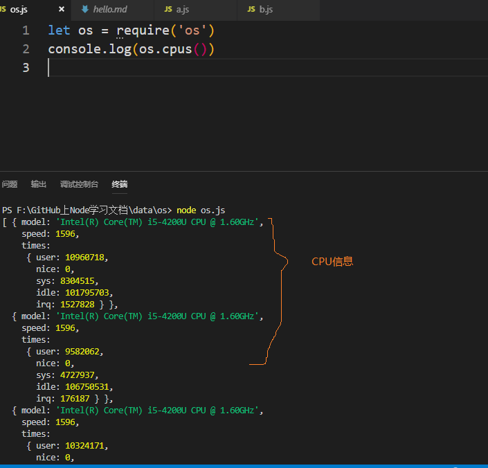

## 前言

Node.js中`path`模块提供了一些路径操作的API，`os`模块提供了一些操作系统相关信息的API。具体可以参考`Node.js`的官方API文档，这里只是简要说明。

1. `path`

* `path.extname()` 获取文件（可以是一个路径文件）的扩展名，演示如下：

```
let path = require('path')

console.log(path.extname('hello.md'))
```
效果如下：


* `path.resolve([...paths])` 把一个路径或路径片段的序列解析为一个绝对路径。

```javascript
path.resolve('foo', '/baz', 'bar');
// 'C:\baz\bar'
```

给定的路径的序列是 "从右往左" 被处理的，后面每个 `path` 被依次解析，直到构造完成一个绝对路径。

* `path.join([...paths])`方法使用平台特定的分隔符把全部给定的 `path` 片段连接到一起，并规范化生成的路径。

```javascript
path.join(__dirname, './02art-template.js');
// 'C:\Users\liangliang17\Desktop\Node_study\Node\5.path\02.art-template.js'

path.join('/foo', 'bar', './baz');
// '/foo/bar/baz'

path.join('/foo', 'bar', '/baz', '..');
// '/foo/bar'
```

**这里简单说一下这几个路径的意思**：
> `__dirname`： 获得当前执行文件所在**目录**的完整目录名

> `__filename`： 获得当前执行**文件**的带有完整绝对路径的文件名

> `process.cwd()`：获得当前执行**node命令**时候的文件夹目录名

2. `os`

* `os.cpus()` 获取操作系统的CPU信息，演示如下：

```
let os = require('os')

console.log(os.cpus())
```
效果如下：



* `os.totalmem()` 获取内存信息，演示如下：

```
let os = require('os')

console.log(os.totalmem())
```
效果如下：

